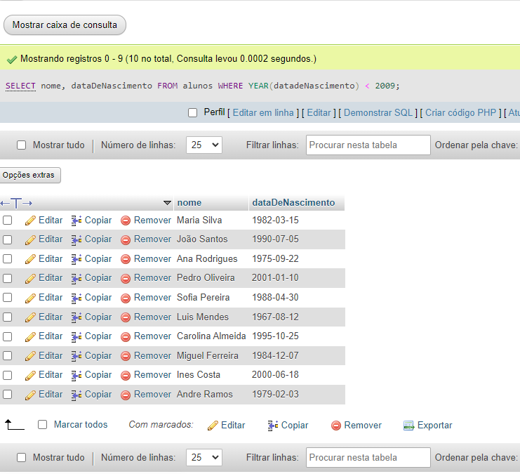
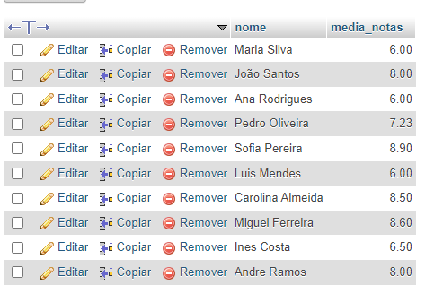

# Exercícios de Banco de Dados - Etapa 3

## CRUD - Consultas

***Atenção**: todos os comandos bem-sucedidos devem ser documentados e colocados no seu repositório do exercício.*

### 1) Faça uma consulta que mostre os alunos que nasceram antes do ano 2009

```sql
SELECT nome, dataDeNascimento FROM alunos WHERE YEAR(datadeNascimento) < 2009;
```

---

### 2) Faça uma consulta que calcule a média das notas de cada aluno e as mostre com duas casas decimais.

```sql
SELECT nome, ROUND((primeiraNota + segundaNota) / 2, 2) AS media_notas
FROM alunos;
```


---

### 3) Faça uma consulta que calcule o limite de faltas de cada curso de acordo com a carga horária. Considere o limite como 25% da carga horária. Classifique em ordem crescente pelo título do curso.

```sql
SELECT titulo, cargaHoraria, ROUND(cargaHoraria * 0.25) AS LimiteFaltas
FROM
    cursos
ORDER BY
    titulo ASC;
```


### 4) Faça uma consulta que mostre os nomes dos professores que são somente da área "desenvolvimento".
```sql
SELECT nome
FROM professores
WHERE areaAtuacao = 'desenvolvimento'
  AND id NOT IN (
      SELECT id
      FROM professores
      WHERE areaAtuacao <> 'desenvolvimento'
  );
```

---

### 5) Faça uma consulta que mostre a quantidade de professores que cada área ("design", "infra", "desenvolvimento") possui.

```sql
SELECT areaAtuacao, COUNT(*) 
FROM professores 
GROUP BY areaAtuacao;

```

---

### 6) Faça uma consulta que mostre o nome dos alunos, o título e a carga horária dos cursos que fazem.

```sql
SELECT alunos.nome, cursos.titulo, cursos.cargaHoraria
FROM alunos
JOIN cursos ON alunos.cursos_id = cursos.id;
```

---

### 7) Faça uma consulta que mostre o nome dos professores e o título do curso que lecionam. Classifique pelo nome do professor.

```sql
SELECT professores.nome, cursos.titulo
FROM professores
JOIN cursos ON professores.cursos_id = cursos.id
ORDER BY professores.nome;
```

---

### 8) Faça uma consulta que mostre o nome dos alunos, o título dos cursos que fazem, e o professor de cada curso.

```sql
SELECT alunos.nome, cursos.titulo, professores.nome
FROM alunos
JOIN cursos ON alunos.cursos_id = cursos.id
JOIN professores ON cursos.professores_id = professores.id;
```

---

### 9) Faça uma consulta que mostre a quantidade de alunos que cada curso possui. Classifique os resultados em ordem descrecente de acordo com a quantidade de alunos.

```sql
SELECT cursos.titulo, COUNT(alunos.id) AS QuantidadeDeAlunos
FROM cursos
JOIN alunos ON cursos.id = alunos.cursos_id
GROUP BY cursos.id
ORDER BY QuantidadeDeAlunos DESC;
```

---

### 10) Faça uma consulta que mostre o nome dos alunos, suas notas, médias, e o título dos cursos que fazem. Devem ser considerados somente os alunos de Front-End e Back-End. Mostre os resultados classificados pelo nome do aluno.

```sql
SELECT
    alunos.nome,
    alunos.primeiraNota,
    alunos.segundaNota,
    ROUND((alunos.primeiraNota + alunos.segundaNota) / 2, 2),
    cursos.titulo
FROM
    alunos
JOIN
    cursos ON alunos.cursos_id = cursos.id
JOIN
    professores ON cursos.professores_id = professores.id
WHERE
    professores.areaAtuacao IN ('Front-End', 'Back-End')
ORDER BY
    alunos.nome;

```
---

### 11) Faça uma consulta que altere o nome do curso de Figma para Adobe XD e sua carga horária de 10 para 15.

```sql
UPDATE cursos
SET titulo = 'Adobe XD', cargaHoraria = 15
WHERE titulo = 'Figma' AND cargaHoraria = 10;
```
---

### 12) Faça uma consulta que exclua um aluno do curso de Redes de Computadores e um aluno do curso de UX/UI.
```sql
DELETE FROM alunos
WHERE cursos_id IN (
    SELECT id
    FROM cursos
    WHERE titulo IN ('Redes de Computadores', 'UX/UI Design')
)
LIMIT 2;
```

---

### 13) Faça uma consulta que mostre a lista de alunos atualizada e o título dos cursos que fazem, classificados pelo nome do aluno.
```sql
SELECT
    alunos.nome,
    cursos.titulo
FROM
    alunos
JOIN
    cursos ON alunos.cursos_id = cursos.id
ORDER BY
    alunos.nome;

```
---

## DESAFIOS

1) Criar uma consulta que calcule a idade do aluno
2) Criar uma consulta que calcule a média das notas de cada aluno e mostre somente os alunos que tiveram a média **maior ou igual a 7**.
3) Criar uma consulta que calcule a média das notas de cada aluno e mostre somente os alunos que tiveram a média **menor que 7**.
4) Criar uma consulta que mostre a quantidade de alunos com média **maior ou igual a 7**.